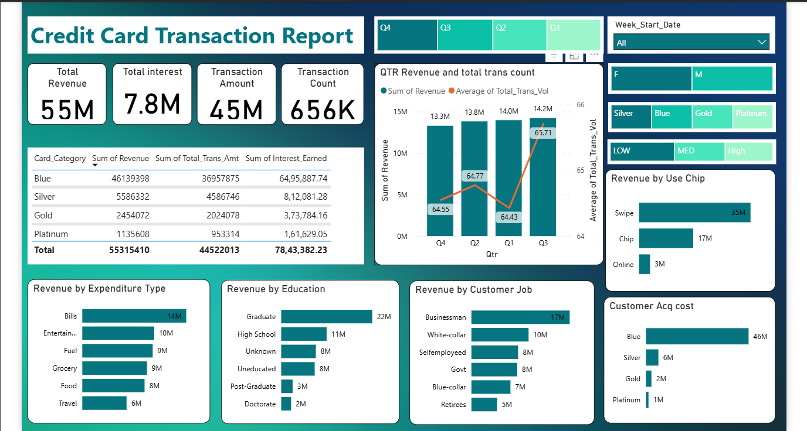
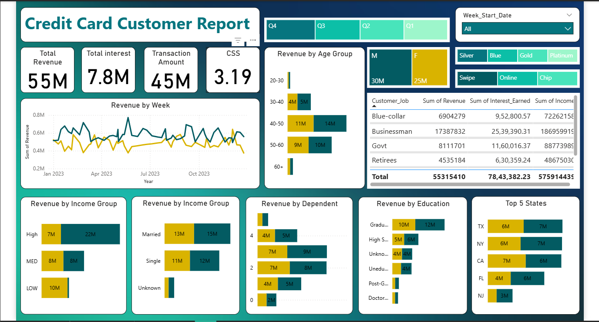

# 💳 Credit Card Financial Dashboard using Power BI

📅 **Project Date**: February 2025  
📊 **Tool Used**: Power BI  
🛢 **Data Source**: MySQL (Customer & Transaction Data)  
🧠 **Type**: Data Analysis & Dashboarding Project

---

## 🧩 Project Overview

This project showcases a comprehensive **Power BI dashboard** designed to deliver real-time insights into **credit card transactions and customer behavior**. It enables stakeholders to explore revenue trends, customer segmentation, and usage patterns — all powered by data from a MySQL database.

---

## 📌 Key Objectives

- Develop an interactive dashboard using customer & transaction data.
- Visualize key financial KPIs such as Revenue, Interest, and Transaction Volume.
- Enable deep-dive analysis through segmentation by card type, income, education, etc.
- Provide business insights for decision-makers to drive credit card growth strategies.

---

## 📈 Dashboard Views

### 🔹 1. Credit Card Transaction Report

- Highlights:  
  - 📌 Total Revenue: **55M**
  - 💰 Transaction Amount: **45M**
  - 🔢 Transaction Count: **656K**
  - 💡 Interest Earned: **7.8M**
- Insights by:
  - Card Category (Blue, Silver, Gold, Platinum)
  - Chip Usage (Swipe, Online, Chip)
  - Expenditure Type, Customer Job, and Education
  - Quarterly revenue and average transaction volume

---

### 🔹 2. Credit Card Customer Report

- Additional KPI: **CSS (Customer Satisfaction Score)** = 3.19
- Trends in revenue across time and demographics:
  - Gender, Age Group, Income Group, Marital Status
  - Dependents, Education Level, and Top 5 Revenue-Contributing States

---

## 🔧 Technologies Used

- **Power BI Desktop** – for dashboard creation and visualization
- **MySQL** – as the source database for structured data
- **SQL** – for data extraction and transformation

---

## 💡 Key Insights

- **Blue card holders** generate the highest revenue and volume.
- **Swipe transactions** dominate chip and online usage.
- Revenue peaks in **Q1 and Q3**, indicating seasonal usage trends.
- **Businessmen**, **Graduates**, and **High-income customers** are top contributors.
- States like **TX, NY, CA** perform best in revenue generation.

---

## 🚀 How to Use

1. Clone or download the repository.
2. Open the `.pbix` file using **Power BI Desktop**.
3. Connect to your own database if desired or explore the visuals directly.
4. Interact with filters and visuals to gain insights!

---

## 📁 Repository Contents

| File                         | Description                                 |
|------------------------------|---------------------------------------------|
| `CreditCard_Financial_Dashboard.pbix` | Main Power BI file                |
| `transaction-dashboard.png`  | Credit Card Transaction Report Screenshot   |
| `customer-dashboard.png`     | Credit Card Customer Report Screenshot      |
| `README.md`                  | Project Overview and Instructions           |

---

## 📬 Contact

**Aryan Gupta**  
📫 [LinkedIn](https://www.linkedin.com/in/aryan-gupta-92644125b) | 📧 [aryangupta240704@email.com]  
🎓 Final-Year IT Student | Passionate about Data Analytics & BI
